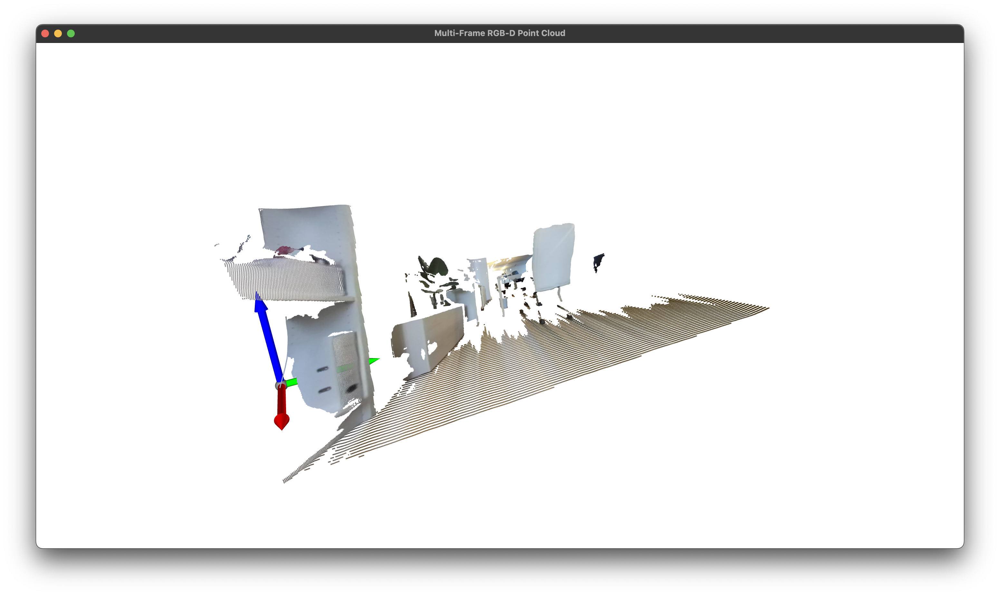
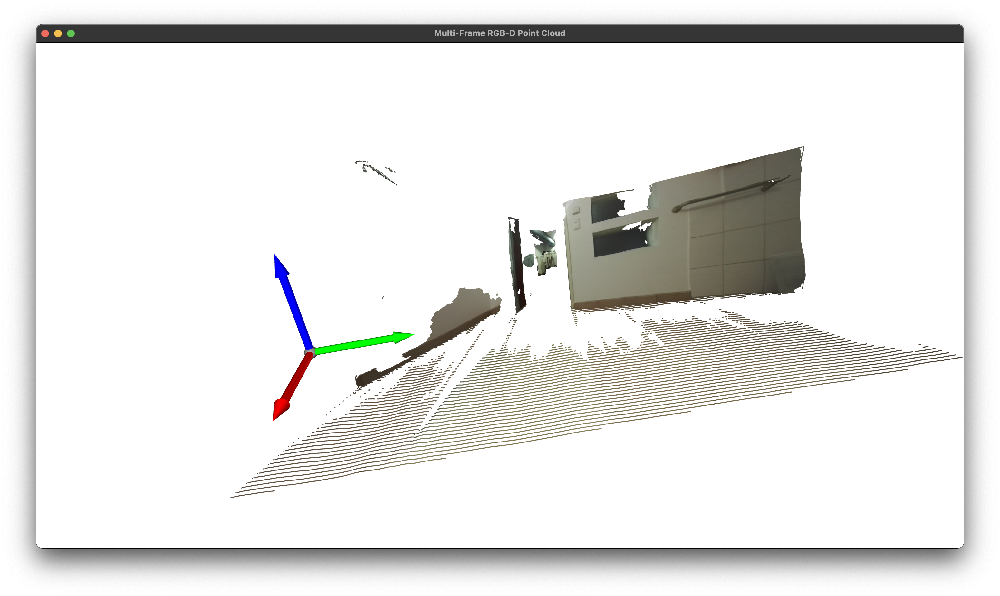

# AICI Challenge 2: Point Cloud Generation




## Overview

This script (`imgd2ply.py`) creates a colorized 3D point cloud from RGB-D camera data stored in a ROS2 bag file. It processes multiple synchronized frames and properly transforms coordinates from the camera optical frame to the world/odom frame.

## Usage

### Creating Virtual Environment

```bash
# Create a new conda environment
conda create -n aici_env python=3.11
conda activate aici_env
```

### Installing Dependencies

Install from requirements.txt:
```bash
pip install -r requirements.txt
```

### Configuration

Before running the script, specify the data path by setting the `bag_path` variable in `imgd2ply.py`:

```python
bag_path = Path("office/rosbag2_2025_10_20-16_09_39")
```

Available data directories:
- `office/rosbag2_2025_10_20-16_09_39` - Office environment
- `bathroom/rosbag2_2025_10_20-16_47_22` - Bathroom environment

### Running the Point Cloud Generation Script

```bash
python imgd2ply.py
```

### Visualizing the Result

Use the visualization script to view the generated point cloud:

```bash
python viz_pcd.py results/bathroom_pcd.ply
```

Or use any PLY viewer:
- Meshlab

**Note:** Additional visualization scripts are available for viewing RGB and depth images separately:
- `viz_image.py` - Visualize RGB images from the rosbag
- `viz_depth.py` - Visualize depth images from the rosbag

## Output

- **Location**: `results/`
## Approach

### 1. **Coordinate Transformation Pipeline**

The script implements a **two-stage transformation** to properly convert RGB-D data into world coordinates:

```
Camera Optical Frame → Base Link Frame → World/Odom Frame
```

#### Stage 1: Camera Optical → Base Link (Ego Coordinates)
- **Purpose**: Transform points from camera coordinates to the robot's base frame
- **Method**: Loads TF (transform) data from `/tf_static` topic in the rosbag


#### Stage 2: Base Link → World/Odom
- **Purpose**: Place each frame's points in the global world frame
- **Method**: Reads robot poses from `/odom` topic

### 2. **RGB-D Data Processing**

#### Depth Conversion
- **Format**: ZED camera provides depth as 16-bit integers in millimeters
- **Processing**: Divides by 1000 to convert to meters (assuming depth values are in millimeters)
- **Filtering**: Removes invalid depths (0m range)

#### Point Cloud Generation
- Uses standard pinhole camera model back-projection:


### 3. **Multi-Frame Accumulation**

- **Synchronization**: Matches RGB and depth frames within 100ms tolerance
- **Downsampling**: Limits each frame to 5000 points to manage memory (was running out of memory using all of the points)
- **Accumulation**: Combines points from all frames into single point cloud
- **Output**: Saves as PLY format 


